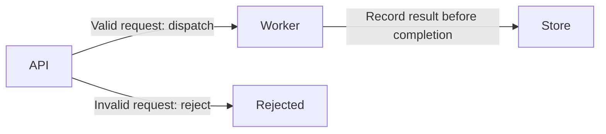

# Diagram authoring examples

These examples support the
[diagram contract](../../docs/standards/engineering-documentation/contract.md#engineering-diagrams)
and [authoring and review lifecycle](../../docs/standards/engineering-documentation/lifecycle-and-validation.md#diagram-authoring-and-review).
They are illustrative excerpts for an owning L0 or L1 section, not a required
document or a copy of the normative rules. Select only what helps explain the
actual system.

## Static figure and explorable view

Replace the example paths and claims with the actual generated artifacts,
owning contract, and verified evidence. The references below are inside a code
example: add them to the document only after their targets exist. An explicit
section state overrides the chapter default; otherwise the diagram inherits it.

The reference-style links in this excerpt are outside the coverage of the
organization's reference link checkers, which inspect inline links only. When
adopting the excerpt, use inline links to the real artifacts or explicitly
validate the reference-style targets with a repository-owned check or recorded
manual check. A passing reference checker alone does not validate these links.

```markdown
### Request processing

State: **Target**

![Example System request processing][request-flow-svg]

[Explore the diagram][request-flow-html] · [Editable source][request-flow-json]

Scope: API request acceptance through Worker result storage. The owning
request-processing contract defines validation and completion semantics.
Authentication is described in the security section.

The API validates a request before dispatching it. The Worker records a result
in the Store before reporting completion. A validation rejection does not
dispatch work. These are Target claims; implementation evidence is still Open.

- Implementation owner: API maintainers own validation; Worker maintainers own
  result storage and completion reporting.
- Remaining gap: implement and verify the described validation, dispatch, and
  result-storage/completion path.
- Promote to As-built when the owning implementation and linked test evidence
  confirm that rejected requests dispatch no work and completion is reported
  only after the result is stored.

[request-flow-svg]: diagrams/request-flow.svg
[request-flow-html]: diagrams/request-flow.html
[request-flow-json]: diagrams/request-flow.json
```

Useful exploratory questions for this example include who accepts a request,
who owns completion, and how rejection differs from successful processing.
Name source references by the claim they support, such as "API validation" or
"Worker completion", and resolve any pinned line range at its exact revision.
Replace this prose with the actual owners and conditions before adoption.

In the repository's authoring guide, record the selected generator identity,
the command that regenerates the HTML, and any tracked rendering corrections.
Document how to export the SVG from that exact HTML using the viewer or a
script, including the options needed to repeat the export. Identify both
artifacts by revision or hash and inspect the SVG in its document embedding
context for preserved styles and meaning.
Explain local HTML opening or link to the existing documentation host. The
example does not provision a viewer, tool installation, or hosting service.

## Mermaid fallback

For example, a change description might state: "Archify is unavailable in this
authoring environment, so this diagram uses Mermaid." Keep the same scope,
state, owner, and failure explanation in the document. This source illustrates
the same Target request-processing flow; it is not an additional required view.

````markdown

````

## Review evidence example

Use an existing change description or validation record. Replace every
illustrative value with the actual evidence and retain any untested scope.

```text
HTML: request-flow.html at <revision or hash>
Static figure: request-flow.svg at <revision or hash>
Generator: <exact version or immutable revision>; <HTML regeneration command>
SVG export: <source HTML identity>; <viewer steps or script command and options>
Generation/export/structure: <commands or procedures and actual results>
Meaning: <owning contract and implementation evidence inspected>
Automated browser inspection: <actual result, viewport and behavior coverage>
Visual/interaction review: <themes, static/HTML scope, interactions and result>
Open findings or untested scope: <specific limitations or none observed>
```

A valid partial record can say that generation passed while browser inspection
was unavailable and the final HTML layout remains untested. A static-only
review can report readable SVG labels while leaving focus, panel scrolling,
resize behavior, and exports unverified. Describe that scope without converting
it into complete viewer acceptance.

For platform-rendered Mermaid, a check of separately delivered HTML can be
`N/A: no separate HTML artifact`. Review the Mermaid meaning and actual rendered
readability. An unavailable browser is an unperformed check with a reason and
untested scope, not `N/A`.
